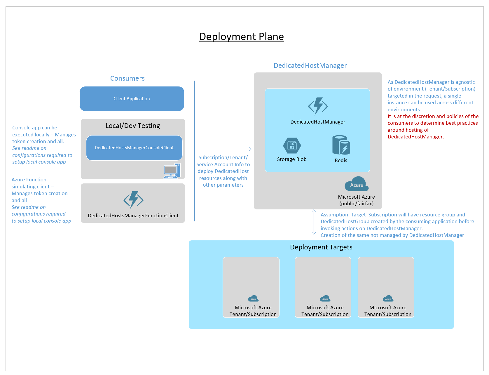

# Dedicated Hosts Manager
Azure Dedicated Host (DH) provides physical servers that host one or more Azure virtual machines; host-level isolation means that capacity is dedicated to your organization and servers are not shared with other customers. To use DH, users currently need to manage DH themselves - e.g. when to spin up or spin down Hosts, determine VM placement on Hosts, bin pack VMs compactly on Hosts to minimize Host usage and optimize for cost, or use another Host selection strategy, manage VM creation traffic burst scenarios, etc.

The Dedicated Hosts Manager library abstracts Host Management logic from users, and makes it easy for users to use DH.
* **CreateVm**: Users only need to specify the number and SKU of VMs that need to be allocated, and this library takes care of the rest. 
* **DeleteVM** Users need to specify VM to delete and library will also deallocate any Host that have no allocated VM.s
* **PrepareDedicatedHostGroup** This call to the Dedicated Host Manager library will prepare the host group by creating sufficient number of dedicated hosts so that a future call to VM or VMSS creation will be successful. 
 
This library is packaged as an Azure Function that can be deployed in your subscription, and is easy to integrate with . The library is extensible and allows for customizing Host selection logic.

 
# Support
* Solution supports Azure Function runtime v3 
* Developed and tested using VS 2019
 
# Usage


## Setup DedicatedHostManager
1. Create a Resource Group using the Azure portal/CLI.
2. Deploy an Azure Function to your resource group.<br>Recommendation is to use App service plan as long running transaction like CreateVM might result in timeout.
3. Create a storage account in your resource group.
4. Create an Azure Redis cache in your resource group.
5. Deploy the Dedicated Hosts Manager function in your resource group, and setup the below config.
    _Application settings:_
    ```json
    {
        "name": "APPINSIGHTS_INSTRUMENTATIONKEY",
        "value": "App Insights Instrumentation Key",
    },
    {
        "name": "ComputeClientHttpTimeoutMin",
        "value": "5",
    },
    {
        "name": "ComputeClientLongRunningOperationRetryTimeoutSeconds",
        "value": "5",
    },
    {
        "name": "DedicatedHostCacheTtlMin",
        "value": "5",
    },
    {
        "name": "DhgCreateRetryCount",
        "value": "3",
    },
    {
        "name": "GetArmMetadataRetryCount",
        "value": "3",
    },
    {
        "name": "GetArmMetadataUrl",
        "value": "https://management.azure.com/metadata/endpoints?api-version=2019-05-01",
    },
    {
        "name": "HostSelectorVmSize",
        "value": "Standard_D2s_v3",
    },
    {
        "name": "IsRunningInFairfax",
        "value": "false",
    },
    {
        "name": "LockContainerName",
        "value": "dhm-sync",
    },
    {
        "name": "LockIntervalInSeconds",
        "value": "60",
    },
    {
        "name": "LockRetryCount",
        "value": "10",
    },
    {
        "name": "MaxIntervalToCheckForVmInSeconds",
        "value": "30",
    },
    {
        "name": "MinIntervalToCheckForVmInSeconds",
        "value": "20",
    },
    {
        "name": "RedisConnectRetryCount",
        "value": "3",
    },
    {
        "name": "RedisConnectTimeoutMilliseconds",
        "value": "5000",
    },
    {
        "name": "RedisSyncTimeoutMilliseconds",
        "value": "10000",
    },
    {
        "name": "RetryCountToCheckVmState",
        "value": "10",
    },
    {
        "name": "VmToHostMapping",
        "value": "{\"Standard_D2s_v3\":\"DSv3-Type1\",\"Standard_D4s_v3\":\"DSv3-Type1\",\"Standard_D8s_v3\":\"DSv3-Type1\",\"Standard_D16s_v3\":\"DSv3-Type1\",\"Standard_D32-8s_v3\":\"DSv3-Type1\",\"Standard_D32-16s_v3\":\"DSv3-Type1\",\"Standard_D32s_v3\":\"DSv3-Type1\",\"Standard_D48s_v3\":\"DSv3-Type1\",\"Standard_D64-16s_v3\":\"DSv3-Type1\",\"Standard_D64-32s_v3\":\"DSv3-Type1\",\"Standard_D64s_v3\":\"DSv3-Type1\",\"Standard_E2s_v3\":\"ESv3-Type1\",\"Standard_E4s_v3\":\"ESv3-Type1\",\"Standard_E8s_v3\":\"ESv3-Type1\",\"Standard_E16s_v3\":\"ESv3-Type1\",\"Standard_E32-8s_v3\":\"ESv3-Type1\",\"Standard_E32-16s_v3\":\"ESv3-Type1\",\"Standard_E32s_v3\":\"ESv3-Type1\",\"Standard_E48s_v3\":\"ESv3-Type1\",\"Standard_E64-16s_v3\":\"ESv3-Type1\",\"Standard_E64-32s_v3\":\"ESv3-Type1\",\"Standard_E64s_v3\":\"ESv3-Type1\",\"Standard_F2s_v3\":\"FSv2-Type2\",\"Standard_F4s_v3\":\"FSv2-Type2\",\"Standard_F8s_v3\":\"FSv2-Type2\",\"Standard_F16s_v3\":\"FSv2-Type2\",\"Standard_F32-8s_v3\":\"FSv2-Type2\",\"Standard_F32-16s_v3\":\"FSv2-Type2\",\"Standard_F32s_v3\":\"FSv2-Type2\",\"Standard_F48s_v3\":\"FSv2-Type2\",\"Standard_F64-16s_v3\":\"FSv2-Type2\",\"Standard_F64-32s_v3\":\"FSv2-Type2\",\"Standard_F64s_v3\":\"FSv2-Type2\"}",
    }
    ,
    {
        "name": "DedicatedHostMapping",
        "value": "[{\"family\":\"DSv3\",\"hostMapping\":[{\"region\":\"default\",\"host\":{\"type\":\"DSv3-Type1\",\"vmMapping\":[{\"size\":\"Standard_D2s_v3\",\"capacity\":32},{\"size\":\"Standard_D4s_v3\",\"capacity\":16},{\"size\":\"Standard_D8s_v3\",\"capacity\":8},{\"size\":\"Standard_D16s_v3\",\"capacity\":4},{\"size\":\"Standard_D32s_v3\",\"capacity\":2},{\"size\":\"Standard_D48s_v3\",\"capacity\":1},{\"size\":\"Standard_D64s_v3\",\"capacity\":1}]}}]}]",
    }
    ```
    _Connection strings:_
    ```json
    {
        "name": "StorageConnectionString",
        "value": "<Your storage connection string>",
    },
    {
        "name": "RedisConnectionString",
        "value": "<Your redis connection string>",
    }
    ```
## Sample Client Apps 
Integrate the Dedicated Host Manager library/function to proxy create/delete VM calls for your existing code.(\Under DedicatedHostManagerClients)
1. If needed, deploy the Dedicated Host Manager Test client (function) in your resource group or Console App on your local machine
2. Configure application settings on the Client app.

    _Application settings:_
    ```json
    {
        "name": "AuthEndpoint",
        "value": "https://login.microsoftonline.us/",
    },
    {
        "name": "AzureRmEndpoint",
        "value": "https://management.usgovcloudapi.net/",
    },
    {
        "name": "CloudName",
        "value": "<Azure cloud name>",
    },
    {
        "name": "ResourceManagerUri",
        "value": "https://management.azure.com/",
    },
    {
        "name": "TenantId",
        "value": "<Target tenant id>",
    },
    {
        "name": "SubscriptionId",
        "value": "<Target subscription id>",
    },
    {
        "name": "ClientId",
        "value": "<Client ID for your AAD service principal on Traget Tenant>",
    },
    {
        "name": "FairfaxClientSecret",
        "value": "<Client secret on Target Tenant - Note: Fairfax prefix to this app setting has no bearing.>",
    },
    {
        "name": "Location",
        "value": "<Target Azure region>",
    },
    {
        "name": "DhmCreateVmnUri",
        "value": "<Create function URL with API key (from step 5 of 'Setup DedicatedHostManager')>",
    },
    {
        "name": "DhmDeleteVmnUri",
        "value": "<Delete function URL with API key(from step 5 of 'Setup DedicatedHostManager')",
    },
    {
        "name": "PrepareDHGroupUri",
        "value": "<PrepareDedicatedHostGroup function URL with API key (from step 5 if 'Setup DedicatedHostManager')",
    }
    ```

8. Run the test Function Or Local Console Client to provision VMs on Dedicated Hosts 

# Solution details
For additional information pertaining to code, refer to [Solution Graph](docs/README.md)

# Next steps
1. Add Acions to setup a DevOps pipeline
2. Testing at scale and with concurrent scenarios

# Contributing

This project welcomes contributions and suggestions.  Most contributions require you to agree to a
Contributor License Agreement (CLA) declaring that you have the right to, and actually do, grant us
the rights to use your contribution. For details, visit https://cla.opensource.microsoft.com.

When you submit a pull request, a CLA bot will automatically determine whether you need to provide
a CLA and decorate the PR appropriately (e.g., status check, comment). Simply follow the instructions
provided by the bot. You will only need to do this once across all repos using our CLA.

This project has adopted the [Microsoft Open Source Code of Conduct](https://opensource.microsoft.com/codeofconduct/).
For more information see the [Code of Conduct FAQ](https://opensource.microsoft.com/codeofconduct/faq/) or
contact [opencode@microsoft.com](mailto:opencode@microsoft.com) with any additional questions or comments.
