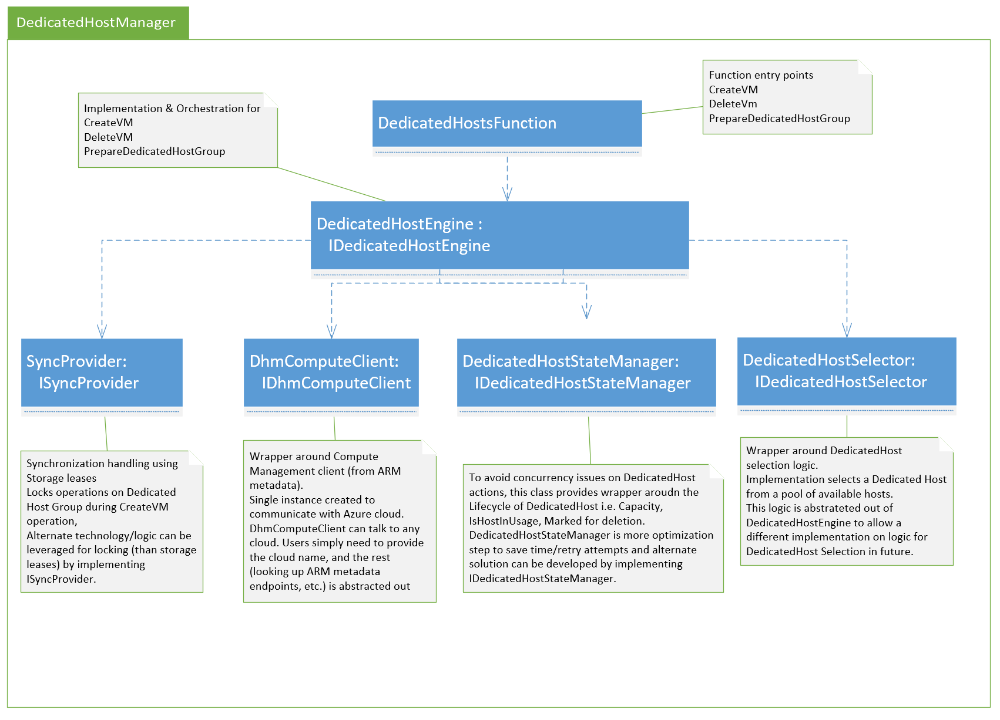

# Solution Graph

* Solution supports Azure Function runtime v3 
* Developed and tested using VS 2019

## Projects
* DedicatedHostManager
Core project and entry point for DedicatedHostManager functionality (Azure Function)
* DedicatedHostsManagerConsoleClient (Client for testing DedicatedHostManager - Console application)
* DedicatedHostsManagerFunctionClient (Client for testing DedicatedHostManager - Azure Function)
* DedicatedHostClientHelpers (Common class library to support DedicatedHostManager client apps)
* DedicatedHostsTests (Unit Tests - XUnit)

## DedicatedHostFunction - Class Map
Following diagram provides class dependency graph.
